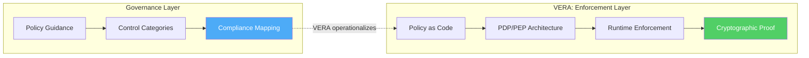
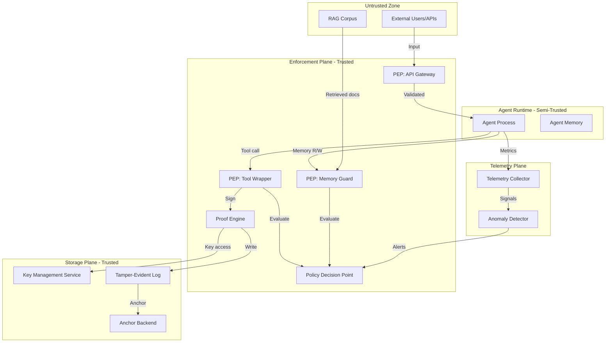

# VERA: Verifiable Enforcement for Runtime Agents

**A Zero Trust Reference Architecture for Autonomous AI Agents**

*Berlin AI Labs — February 2026*

---

## Abstract

AI agents take real actions with real data at machine speed. Compromised AI agents pose significant risks including data exfiltration, unauthorized financial transactions, and cascading failures across downstream systems, often at speeds that preclude human intervention.

The security community has responded with governance frameworks that specify what to document, what to log, and what to monitor. These frameworks provide valuable guidance but leave a critical gap: none define the runtime enforcement layer that makes governance verifiable.

This paper introduces **VERA** (Verifiable Enforcement for Runtime Agents), a zero trust reference architecture for AI agents that prioritizes enforcement over documentation, cryptographic proof over policy assertions, and reference implementation over specification prose. VERA provides:

- A **structured threat model** with five adversary classes, capability matrices, and OWASP Top 10 coverage mapping
- **Five enforcement pillars** with typed schemas, explicit PDP/PEP placement, and two reference deployment patterns
- **Four stated security properties** with definitions, structured security arguments under stated cryptographic assumptions, and a TLA+ model-checked specification of chain tamper-evidence (Property 2)
- An **evidence-based maturity runtime** where agents earn autonomy through cryptographic proof rather than calendar time
- **Memory and RAG governance** addressing the most under-specified agent attack surface
- **Empirical results** from 12 open source reference implementations validated against adversarial test suites

VERA is backed by reference implementations. All 12 services are open source (MIT), independently deployable, and validated with 25+ contract tests in controlled environments.

**Keywords:** Zero Trust, AI Agents, Runtime Enforcement, Proof of Execution, Agent Security, Verifiable Governance

---

## 1. The Problem: The Enforcement Gap

While NIST SP 800-207 supports non-human subjects, most enterprise implementations and assumptions—session models, decision cadence, observability—were developed around human and workload access patterns. They do not directly address autonomous agent loops, tool-chaining, or non-deterministic decision-making. AI agents violate the operational assumptions behind typical Zero Trust deployments.

| Assumption | Human User | AI Agent |
|:---|:---|:---|
| Behavior | Predictable patterns | Non-deterministic, adapts to context |
| Sessions | Login, work, logout | Continuous autonomous loops |
| Access | One resource at a time | Chains 30+ API calls in sequence |
| Intent | Stated and observable | Emergent from model weights |
| Failure mode | Wrong click | Data exfiltration at scale |

The security industry has responded with a wave of governance frameworks. They share a common structure: five to seven categories of security controls, a maturity model with three to five levels, compliance mappings to SOC 2 and ISO 27001, and an implementation section that recommends JWT for identity and structured logging for observability.

These frameworks provide useful guidance for organizations beginning their agent security journey. However, most share a structural limitation: **they do not fully define where policies are evaluated, where they are enforced, how telemetry feeds back into policy decisions, or how to prove that enforcement actually occurred.** Some agent-security products define partial enforcement points (e.g., gateway proxies, sandboxed runtimes), but no existing framework provides the complete PDP/PEP architecture with cryptographic enforcement proof that VERA specifies. Without these architectural elements, governance controls exist on paper but cannot be independently verified at runtime.

VERA addresses this enforcement gap by providing the architectural layer between governance guidance and running infrastructure. Rather than replacing existing governance frameworks, VERA operationalizes them with enforceable controls, verifiable proofs, and measurable outcomes.



### 1.1 Three Structural Gaps in Current Approaches

We identify three structural gaps common to current AI agent security frameworks:

**Gap 1: Specification without enforcement architecture.** Frameworks that recommend "implement anomaly detection" without specifying detection methods for non-deterministic LLM-based agents leave significant implementation decisions to each organization. Anomaly detection for agents requires distributional baselines for systems that produce different outputs for identical inputs. This is a solvable problem (Section 4.2.3), but it requires specification.

**Gap 2: Calendar-based trust.** Current maturity models treat trust as something that accumulates over time ("promote after 4 weeks with >95% approval rate"). This creates two problems. First, it is disconnected from evidence: an agent that processes 10 million transactions in 4 weeks is not comparable to one that processes 10. Second, it is gameable: a malicious agent can perform correctly during evaluation periods and behave differently in production. Trust should be evidence-based and continuously verified (Section 5).

**Gap 3: Missing policy architecture.** NIST SP 800-207 defines a reference architecture with explicit Policy Decision Points (PDP), Policy Enforcement Points (PEP), and continuous diagnostics. Current AI agent frameworks mention "policy as code" without specifying PDP placement, PEP enforcement points, decision cadence, or telemetry feedback loops. Without this architecture, "zero trust" describes a goal rather than a verifiable property.

### 1.2 Comparative Framework Analysis

To ground VERA's contribution, we compare enforcement coverage across existing frameworks:

| Control | NIST 800-207 | OWASP Top 10 Agentic | MAESTRO | AWS Scoping | VERA |
|:---|:---:|:---:|:---:|:---:|:---:|
| Formal threat model | ✅ | Partial | ✅ | ❌ | ✅ |
| PDP/PEP architecture | ✅ | ❌ | ❌ | ❌ | ✅ |
| Typed schemas | ❌ | ❌ | ❌ | ❌ | ✅ |
| Evidence-based trust | ❌ | ❌ | ❌ | ❌ | ✅ |
| Tool-parameter authorization | ❌ | Partial | ❌ | ❌ | ✅ |
| Memory/RAG governance | ❌ | ✅ | Partial | ❌ | ✅ |
| Supply chain verification | ❌ | ✅ | Partial | ❌ | ✅ |
| Anomaly detection for LLMs | ❌ | ❌ | ❌ | ❌ | ✅ |
| Cryptographic proof of execution | ❌ | ❌ | ❌ | ❌ | ✅ |
| Reference implementation | ❌ | ❌ | ❌ | ❌ | ✅ (12 services, validated in controlled environments) |

---

## 2. Threat Model

VERA defines five adversary classes with explicit capability boundaries, trust assumptions, and control mappings.

### 2.1 Assets and Trust Boundaries

**Protected assets:** Agent signing keys, customer data processed by agents, tool credentials, policy configurations, PoE audit trail, model weights, RAG corpus.

**Trust boundaries:** Enforcement Plane (PDP, PEPs, Proof Engine) is trusted. Storage Plane (KMS, logs, anchors) is trusted. Agent Runtime is semi-trusted. External inputs (users, APIs, RAG documents) are untrusted.

**Assumptions:** Policy engine is not compromised (if compromised, all enforcement is void). Key store provides hardware or attested isolation. At least one anchor backend is honest.

### 2.2 Adversary Classes and Capability Matrix

| Capability | Manipulator | Insider | Escalator | Evader | Compromiser |
|:---|:---:|:---:|:---:|:---:|:---:|
| Submit crafted inputs | ✅ | ✅ | ❌ | ❌ | ❌ |
| Modify agent code/config | ❌ | ✅ | ❌ | ❌ | ✅ |
| Read agent memory | ❌ | ✅ | ✅ | ✅ | ✅ |
| Write to agent memory | ❌ | ✅ | Partial | ✅ | ✅ |
| Modify model weights | ❌ | ✅ | ❌ | ❌ | Possible |
| Access signing keys | ❌ | ❌ (A3) | ❌ | ❌ | ✅ (via KMS) |
| Modify policy bundles | ❌ | ✅ | ❌ | ❌ | ✅ |
| Inject telemetry signals | ❌ | ❌ | ❌ | ✅ | ✅ |
| Control compromised agent | ❌ | ❌ | ✅ | ✅ | ✅ |
| Network position (on-path) | ❌ | Possible | ❌ | ❌ | ✅ |
| Deploy modified PEP/PDP | ❌ | ❌ | ❌ | ❌ | ✅ |
| Forge PoE records | ❌ | ❌ | ❌ | ❌ | ✅ |
| Suppress anchoring | ❌ | ❌ | ❌ | ❌ | ✅ |

**Adversary Class 1: Manipulator (External Input Attacks)**

- **Capabilities:** Submit crafted inputs to agent-exposed interfaces (APIs, chat, file uploads). Cannot modify code or access internal systems.
- **Goals:** Hijack behavior via prompt injection, data poisoning, schema manipulation.
- **Attack surfaces:** Direct/indirect prompt injection, RAG poisoning, encoded payloads (base64, Unicode homoglyphs), malformed-but-valid JSON.
- **VERA controls:** ConvoGuard ONNX firewall (PEP: Input Gateway), schema validation, source trust scoring.
- **Mapping to A1-A4:** A1-A4 hold. Manipulator cannot access keys (A3) or anchors (A4).

**Adversary Class 2: Insider (Supply Chain & Deployment)**

- **Capabilities:** Modify agent code, dependencies, model weights, configuration, or deployment pipelines. May have network position.
- **Goals:** Introduce backdoors, poison fine-tunes, compromise dependencies.
- **Attack surfaces:** Model poisoning (backdoored LoRA), dependency injection (typosquatting), config tampering, prompt template injection, policy bundle poisoning.
- **VERA controls:** PoE with Ed25519 signatures, SBOM verification, signed tool manifests, Git signed commits.
- **Mapping to A1-A4:** A3 holds (keys in HSM, inaccessible to insider). A4 holds if anchor is external. If insider controls policy repo, A3 still protects PoE integrity but policy correctness is compromised — mitigated by PR review + signed policy bundles.

**Adversary Class 3: Escalator (Privilege & Trust Exploitation)**

- **Capabilities:** Controls a compromised low-privilege agent. Can read agent memory and attempt privilege escalation.
- **Goals:** Escalate privileges, game maturity promotion, abuse delegation chains.
- **Attack surfaces:** Maturity gaming (inflating metrics), delegation chain abuse, tool authorization bypass, multi-agent consensus poisoning.
- **VERA controls:** Evidence-based promotion with signed portfolios, capability attenuation in delegation, tool-parameter PEP enforcement.
- **Mapping to A1-A4:** A1-A3 hold. Escalator cannot forge signatures (A1) or access other agents' keys (A3). Gaming evidence portfolios requires compromising external evaluation datasets or approval signers.

**Adversary Class 4: Evader (Detection & Containment Bypass)**

- **Capabilities:** Persistent access to compromised agent. Can inject false telemetry signals.
- **Goals:** Maintain covert access, exfiltrate slowly, evade containment, survive kill switch.
- **Attack surfaces:** Slow exfiltration (below thresholds), baseline mimicry, anti-forensics (log tampering), containment evasion, telemetry poisoning to force demotion of legitimate agents.
- **VERA controls:** PoE chain (tamper-evident under A2+A4), multi-source anomaly signals (requires compromise of 3+ independent signal sources), multi-stage containment.
- **Mapping to A1-A4:** A4 is critical — if anchor is compromised, Evader can suppress PoE records. Mitigated by requiring external anchoring for T3+ agents.

**Adversary Class 5: Enforcement-Plane Compromiser (Control-Plane & KMS Misuse)**

- **Capabilities:** Deploy modified PEP/PDP images, call KMS signing APIs outside the PEP, tamper with policy bundle distribution, forge PoE records, suppress anchoring.
- **Goals:** Bypass all enforcement by compromising the trusted base, sign arbitrary claims via KMS, weaken policy without detection.
- **Attack surfaces:** CI/CD pipeline for PEP image updates, cloud IAM principals with KMS `Sign` permissions, bundle distribution server, node-level sidecar injection, container escape to host.
- **VERA controls:** PEP/PDP artifact signing and admission control (cosign + Kyverno/Gatekeeper), SLSA Level 2+ provenance, separation of duties (policy authors ≠ PEP deployers), KMS condition keys restricting `Sign` to attested SPIFFE IDs, quorum-based signing for T4 agents (two-person rule), independent witnesses that verify PoE/receipt consistency and anchor alerts externally.
- **Mapping to A1-A4:** A3 is the primary target. Mitigated by restricting KMS `Sign` API access to attested PEP/Proof Engine identities only (IAM condition keys + SPIFFE workload attestation). Residual: compromiser with cloud admin access can modify IAM policies.

### 2.3 Combined Attack Scenarios

| Scenario | Classes | Attack Path | VERA Mitigation | Residual Risk |
|:---|:---|:---|:---|:---|
| Poisoned RAG + prompt injection | Manipulator + Insider | Insider poisons corpus, Manipulator triggers retrieval | Source trust scoring + input firewall | Slow corpus poisoning below detection |
| Privilege escalation + evasion | Escalator + Evader | Compromised agent escalates, then evades detection | Evidence portfolio + multi-source signals | Colluding approvers |
| Supply chain + telemetry manipulation | Insider + Evader | Backdoored dependency + false telemetry | SBOM gates + 3-source signal requirement | Zero-day in signed dependency |

---

## 3. Stated Security Properties

We define the security properties VERA guarantees under stated assumptions. These are structured definitions with security arguments, not formal theorems proven in a theorem prover (e.g., Coq, Isabelle/HOL). Property 2 (Chain Tamper-Evidence) has been model-checked using TLA+ with the TLC model checker (see §3.4). Full formal verification of all properties using mechanized proof assistants is left to future work.

### 3.0 System Model

We formalize VERA's enforcement architecture as a tuple **Σ = (A, T, K, π, E, C, V)** where:

- **A** = {a₁, ..., aₙ} is a finite set of *agent identities*, each aᵢ bound to a DID:web identifier and a trust tier τ(aᵢ) ∈ {T1, T2, T3, T4}.
- **T** = {t₁, ..., tₘ} is a finite set of *tools* (externally observable actions). Each tool tⱼ has a parameter schema Φ(tⱼ).
- **K** = {(pkᵢ, skᵢ)} is the set of *signing keypairs*. Under assumption A3, agent aᵢ has no access to skᵢ; only the Proof Engine (within the enforcement plane) can invoke Sign(skᵢ, ·).
- **π: A × T × Params → {allow, deny, escalate}** is the *policy function*, evaluated by the PDP. π is defined as a set of Rego rules over the input schema (§4.4).
- **E: A × T × Params → PoE** is the *enforcement function*. For each authorized action (aᵢ, tⱼ, p) where π(aᵢ, tⱼ, p) = allow, E produces a Proof of Execution record:
  - E(aᵢ, tⱼ, p) = (actionId, agentDid, action, seq, H(PoEprev), Sign(skₑ, canonical(·)), ts)
  - where seq is monotonically increasing per agent session, H is SHA-256, and canonical(·) is JCS (RFC 8785).
- **C = [PoE₁, PoE₂, ..., PoEₙ]** is the *PoE chain*, a hash-linked sequence where PoEᵢ.prevHash = H(PoEᵢ₋₁) and PoE₁.prevHash = GENESIS_HASH.
- **V: C → {valid, tampered}** is the *verification function*. V(C) = valid iff: (1) ∀i: Verify(pkₑ, canonical(PoEᵢ), σᵢ) = true, (2) ∀i>1: PoEᵢ.prevHash = H(PoEᵢ₋₁), (3) ∀i: PoEᵢ.seq = PoEᵢ₋₁.seq + 1.

**Adversary model (informal):** An adversary 𝒜 controls the agent runtime but not the enforcement plane {π, E, K}. 𝒜 can submit arbitrary inputs to the PEP and observe outputs. 𝒜 wins the non-repudiation game if it forges a valid PoE without PEP involvement (reduced to EU-CMA under A1+A3). 𝒜 wins the tamper-evidence game if it produces C' ≠ C such that V(C') = valid (reduced to collision resistance under A2+A4).

### 3.1 Cryptographic Assumptions

- **A1 (Signature Unforgeability):** The configured signature algorithm is existentially unforgeable under chosen-message attacks (EU-CMA). **Default algorithm selection depends on deployment profile:** Ed25519 [Bernstein et al., 2012] for software/sidecar signers where keys are generated locally; ECDSA P-256 [NIST FIPS 186-5] for cloud KMS/HSM-backed signing where Ed25519 may not be available. Note: Ed25519 HSM support varies by cloud provider and product tier (at time of writing, per vendor documentation consulted February 2026; providers update capabilities frequently—organizations MUST verify current support before deployment). Organizations SHOULD maintain a versioned compatibility matrix in their deployment documentation.
- **A1' (Cryptographic Agility):** VERA MUST support algorithm negotiation to enable post-quantum migration. Supported: Ed25519 (software signer), ECDSA P-256 (cloud KMS/HSM). SHOULD support: ML-DSA-65 (NIST FIPS 204, August 2024) [Ducas et al., 2018; NIST, 2024]. The `signatureAlgorithm` field in PoE records and Tool Execution Receipts enables algorithm-heterogeneous verification chains. **Downgrade protection:** Verifiers MUST reject PoE records signed with algorithms below the minimum strength configured for the agent's trust tier (e.g., T4 agents MUST NOT use algorithms with <128-bit security).
- **A2 (Hash Collision Resistance):** SHA-256 is collision-resistant. No efficient adversary can find two distinct inputs that produce the same hash.
- **A3 (Trusted Key Store):** Agent signing keys are stored in a hardware-backed key management system (HSM or cloud KMS) that prevents key exfiltration by the agent runtime. Signing requests MUST originate only from PEP/Proof Engine processes with attested identity; the agent process has no network path or IAM permissions to the signing service directly. Note: Kubernetes sealed-secrets protect secrets at rest in Git but do not prevent runtime exfiltration once decrypted—they do not satisfy A3's non-exfiltration requirement. **Deployment profiles for A3 implementation:** (a) *Software signer* — Ed25519 keypair in hardened sidecar with sealed key + node attestation (acceptable for T1-T2 agents); (b) *Cloud KMS/HSM* — ECDSA P-256 with HSM backing via AWS CloudHSM, GCP Cloud HSM, or Azure Managed HSM (recommended for T3 agents); (c) *TEE-backed signer* — key material within AMD SEV-SNP or Intel SGX enclave, with remote attestation to PEP (required for T4 agents). **Cloud Provider Trust:** VERA assumes cloud KMS operators are honest with respect to key material confidentiality. Cloud admin compromise is modeled under Adversary Class 5; organizations requiring stronger guarantees SHOULD use on-premise HSMs or TEE-backed KMS [Costan & Devadas, 2016; AMD SEV-SNP, 2024].
- **A4 (Anchor Integrity):** At least one tamper-evident anchor backend (transparency log, WORM storage, or blockchain) is available and not controlled by the adversary. **Anchoring cadence requirements:** T1-T2 agents: anchor chain heads at least every 60 minutes. T3 agents: anchor every 15 minutes. T4 agents: anchor every 5 minutes or per-action. Between anchors, an adversary with log write access could theoretically rewrite unanchored chain entries; the anchoring cadence defines the maximum rewrite window.

### 3.2 Property Definitions

**Definition 1 (PEP-Attested Action Non-Repudiation).** An agent action `a` is non-repudiable if there exists a Proof of Execution `PoE(a)` containing a signature `σ` by the PEP/Proof Engine key `pk_enforcer`, such that `Verify(pk_enforcer, canonical(a), σ) = true`. Under assumptions A1 and A3, this proves that the enforcement plane authorized and recorded action `a` as performed by the agent identified by `agentDid`. The signature attests that enforcement occurred, not that the agent independently asserts the action — the agent runtime has no access to signing keys (A3). For end-to-end verifiable enforcement, PoE SHOULD be accompanied by a Tool Execution Receipt (§4.2.1a) signed by the tool's own key.

**Definition 2 (Chain Tamper-Evidence).** A sequence of agent actions `[a₁, a₂, ..., aₙ]` is tamper-evident if each `PoE(aᵢ)` contains a monotonically increasing sequence number `sᵢ` and the hash of the previous proof `H(PoE(aᵢ₋₁))`. Under assumption A2, any deletion, reordering, or insertion of actions produces a detectable gap or hash mismatch. For multi-replica deployments, each replica maintains an independent PoE chain identified by `(agentDid, instanceId)`. Cross-replica ordering is established via anchor timestamps.

**Definition 3 (Policy Enforcement Completeness).** A VERA-compliant deployment has complete policy enforcement *with respect to the controlled action surface S*, where S is the set of action types mediated by PEPs and independently observable via signed tool execution receipts or constrained network paths. Completeness is verifiable when: (1) every action in S passes through at least one PEP, (2) tool execution receipts are cryptographically bound to PEP authorization records via shared nonces, and (3) actions outside S (e.g., raw sockets, container escapes) are blocked by network egress controls or detectable via kernel-level audit. An action in S that bypasses all PEPs is a policy violation, detectable by comparing tool-side signed receipts against PEP evaluation records.

**Definition 4 (Containment Bound).** The maximum financial damage from a compromised agent is bounded by: `max_loss ≤ min(hourly_value_cap_remaining, per_tx_value_cap × max_tx_in_window)`, where `max_tx_in_window = rate_limit_tx_per_sec × circuit_breaker_activation_time_sec`. This bound assumes synchronous enforcement; in-flight asynchronous operations (queued transactions, eventual-consistency writes) may produce damage beyond this bound until in-flight cancellation completes (SLA: < 10s).

### 3.3 Security Arguments

The following are structured security arguments presented in game-based notation. These are proof sketches that clarify the security reductions under assumptions A1–A4, not full formal proofs. A rigorous treatment would require modeling the multi-party agent-PEP-tool interaction as a formal protocol and is left to future work.
**Security Argument 1: Non-Repudiation.**

*Game NR:* Challenger C generates enforcement keypair `(pk_e, sk_e)` and gives `pk_e` to adversary A. A may query a signing oracle `Sign(sk_e, ·)` adaptively. A wins if it outputs `(a*, σ*)` such that `Verify(pk_e, canonical(a*), σ*) = true` and `a*` was never queried to `Sign`. By A1 (EU-CMA security of Ed25519 [Bernstein et al., 2012]), `Pr[A wins] ≤ negl(λ)`. By A3, the agent runtime has no access to `sk_e`, so valid PoE signatures can only originate from the PEP/Proof Engine. Combined with a Tool Execution Receipt signed by the tool's key `pk_t`, a third party can verify: PDP authorized → PEP enforced (PoE) → tool executed (receipt). PoE alone guarantees non-repudiation of the *enforcement record*, not correctness of execution. ∎

**Security Argument 2: Chain Tamper-Evidence.**

*Game TE:* Given a valid PoE chain `[PoE(a₁), ..., PoE(aₙ)]` where each `PoE(aᵢ)` contains `H(PoE(aᵢ₋₁))`, adversary A outputs a modified chain `[PoE(a'₁), ..., PoE(a'ₘ)]` that passes all hash-link and sequence-number checks but `∃ i: a'ᵢ ≠ aᵢ`. This requires finding `a'ᵢ ≠ aᵢ` such that `SHA-256(canonical(PoE(a'ᵢ))) = SHA-256(canonical(PoE(aᵢ)))`. By A2 (collision resistance of SHA-256), `Pr[A wins] ≤ negl(λ)`. Anchor integrity (A4) externalizes the chain head hash, preventing wholesale chain replacement. ∎

**Security Argument 3: Policy Enforcement Completeness.**

*Game PC:* For controlled action surface S (the set of action types mediated by PEPs with constrained egress), adversary A attempts to execute action `a ∈ S` without triggering a PoE record. By the constrained egress invariant (default-deny, all egress routes through PEP proxies), A must interact with a PEP to execute `a`. The PEP generates a PoE record for every authorized action. To skip the PEP, A must bypass network segmentation (container escape, sidecar injection), which is detectable via kernel-level audit (seccomp/eBPF) [Gregg, 2019] and constitutes an Adversary Class 5 attack. Completeness is conditional on the egress invariant holding. ∎

### 3.4 TLA+ Model-Checked Specification (Property 2)

To provide formal rigor beyond structured security arguments, we provide a TLA+ specification of Property 2 (Chain Tamper-Evidence) that has been verified using the TLC model checker.

The specification (`formal/PoEChain.tla` in the reference implementation repository) models:

- **State variables:** The honest PoE chain, an external anchor log, sequence counters, and an adversary's tampered chain.
- **Honest actions:** `AppendPoE` (agent appends a new signed PoE) and `AnchorLatest` (latest PoE is externally anchored).
- **Adversary actions:** `AdversaryDelete` (remove a chain entry), `AdversaryReorder` (swap two entries), `AdversaryInsertFake` (insert a fabricated PoE with a forged signature).

**Verified invariants (6):**

| Invariant | Property |
|:---|:---|
| `ChainIntegrity` | Every record references the hash of its predecessor |
| `MonotonicSequence` | Sequence numbers are strictly increasing |
| `NoSequenceGaps` | No gaps in sequence numbers |
| `GenesisBinding` | First record references GENESIS_HASH |
| `AllSignaturesValid` | All records bear valid PEP signatures |
| `AnchorImmutability` | Anchored hashes persist in the external log |

**Verified tamper-detection theorems (3):**

| Theorem | Statement |
|:---|:---|
| `DeletionDetectable` | If any record is deleted, hash linkage breaks at or after the deletion point |
| `ReorderingDetectable` | If any records are swapped, hash linkage breaks |
| `InsertionDetectable` | If a fabricated record is inserted, signature verification fails (unforgeability assumption) |

**Model-checking parameters:** MaxActions=4, 2 agents, 3 action types. The TLC model checker exhaustively explores all reachable states under this configuration and confirms that all invariants hold and all tamper-detection theorems are satisfied.

**Limitations of model checking:** TLC provides bounded verification—it confirms properties hold for chains up to length 4 with the specified agent/action configuration. This does not constitute a proof for unbounded chains, but it provides significantly stronger evidence than security arguments alone. Mechanized proof using TLAPS (TLA+ Proof System) or Coq for unbounded chains is future work.

---

## 4. VERA Architecture: Five Enforcement Pillars

### 4.0 Trust Boundaries and Deployment Patterns

**Normative definition of "agent action":** In VERA, an *action* is any operation that causes an externally observable side effect or crosses a trust boundary: tool invocation, network request, data store read/write, RAG retrieval, privileged OS call, or inter-agent delegation. Pure reasoning steps that do not cross a controllable boundary are out of scope for enforcement and only observable indirectly via PoE metadata (timing, token counts). VERA enforces at the action boundary; it does not instrument the agent's internal computation.

**Action coverage matrix:** Each action type maps to an enforcement point and bypass detection mechanism:

| Action Type | Enforcement Point (PEP) | Bypass Detection Method |
|:---|:---|:---|
| Tool invocation | Tool wrapper PEP | Compare tool-side invocation logs vs PoE records |
| Network request | Egress proxy / API gateway PEP | Compare egress firewall logs vs PoE; deny direct egress |
| Data store read/write | Storage proxy PEP | Compare DB query logs vs PoE evaluation records |
| RAG retrieval | Memory guard PEP | Compare retrieval engine logs vs PoE retrieval records |
| OS / privileged call | Seccomp/eBPF syscall filter | Compare syscall audit log vs PoE action inventory |
| Inter-agent delegation | Delegation PEP (A2A gateway) | Compare receiving agent's inbound PoE vs delegating agent's outbound PoE |

**Baseline requirement:** All agent runtime egress MUST traverse a constrained egress proxy or sidecar; direct network egress is denied by default. This is standard Zero Trust microsegmentation applied to agent runtimes and closes the primary bypass class (out-of-band HTTP calls that skip tool wrappers).

Before detailing each pillar, we define VERA's trust boundaries and two reference deployment patterns.

#### Trust Boundaries



**Trust assumptions:**
- **Enforcement Plane** is trusted for enforcement integrity. PDP, PEPs, and Proof Engine run in verified environments (container attestation, SPIFFE/SVID, or equivalent). PDP MUST sign Decision Tokens (see below).
- **Agent Runtime** is semi-trusted. The agent executes within enforcement plane boundaries but may behave unexpectedly due to non-determinism, prompt injection, or compromise.
- **Storage Plane** trust is differentiated: KMS is trusted for *key non-exfiltration* (A3). Logs are *not trusted for integrity* without external anchoring (A4)—a compromised log admin can modify unanchored entries. Anchors assume at least one honest backend (A4).
- **Untrusted Zone** includes all external inputs: user requests, API responses, RAG documents.

**PDP Decision Token (normative):** To prevent PEP or log fabrication of authorization provenance, the PDP MUST emit a signed Decision Token for each evaluation:

```typescript
interface PDPDecisionToken {
  decisionId: string;             // Unique decision identifier
  agentDid: string;               // Requesting agent
  actionType: string;             // Tool, network, storage, etc.
  toolId: string;                 // Target tool/resource
  requestHash: string;            // Hash of request parameters
  decision: 'ALLOW' | 'DENY';    // PDP verdict
  obligations: string[];          // Post-decision requirements
  policyBundleHash: string;       // Policy snapshot hash
  expiry: ISO8601;                // Decision TTL
  signature: string;              // PDP's signing key (separate from PEP key)
}
```

The PEP MUST include `H(DecisionToken)` in the PoE record and forward the token (or its hash) to the tool with the authorized request. A third-party verifier can then independently confirm: (1) PDP issued the decision (signature verification), (2) PEP enforced the decision (PoE references the token hash), (3) tool received the authorized request (receipt nonce binds to token). Without signed Decision Tokens, a compromised PEP could fabricate `pdpDecisionId` fields.

**Trusted Computing Base (TCB) per property:**

| Security Property | Trusted Components | Guarantee Under Partial Compromise |
|:---|:---|:---|
| Non-repudiation (Def 1) | KMS (A3), Proof Engine | Holds if KMS and Proof Engine uncompromised; PDP/PEP compromise cannot forge PoE |
| Chain tamper-evidence (Def 2) | Hash function (A2), Anchor backend (A4) | Holds if SHA-256 and ≥1 anchor uncompromised; log admin compromise bounded by anchoring cadence |
| Policy completeness (Def 3) | PDP, PEP, Network controls | Degrades if PDP compromised (wrong decisions) or PEP compromised (bypass). Network controls independent. |
| Containment (Def 4) | PDP, PEP, Rate limiter | Degrades if any enforcement component compromised. In-flight damage bounded by SLA. |
| Tool execution verification | Tool signer (receipt), Gateway (if `gateway-observed`) | Degrades to audit trail if tool key compromised. False receipts detectable via cross-referencing. |

#### Deployment Pattern A: Central PDP (Enterprise)

```
Agent₁ ─→ PEP (sidecar) ─→ Central PDP (OPA cluster)
Agent₂ ─→ PEP (sidecar) ─→ Central PDP (OPA cluster)
Agent₃ ─→ PEP (sidecar) ─→ Central PDP (OPA cluster)
```

- PEPs deployed as sidecars per agent runtime
- Centralized PDP cluster (OPA) for consistent policy evaluation
- **Fail behavior:** Fail-closed (deny all) for T3/T4 agents; configurable fail-open window (max 30s) for T1/T2
- **Latency:** 5-15ms per policy evaluation (network + OPA query)
- **Availability:** PDP cluster requires 3+ replicas behind a load balancer; OPA is stateless for evaluation, so no leader election is required for correctness. Bundle distribution service handles policy updates independently.

#### Deployment Pattern B: Hardened Sidecar PDP (Edge / Low-Latency)

```
Agent₁ ─→ PEP+PDP (hardened sidecar, OPA bundle) ─→ Local decision
Agent₂ ─→ PEP+PDP (hardened sidecar, OPA bundle) ─→ Local decision
```

- PDP and PEP run in a **separate hardened process** (sidecar container, microVM, or TEE enclave), **not** as a library within the agent process. This is critical: embedding enforcement in the agent runtime would allow a compromised agent to bypass policy evaluation, violating the trust boundary model.
- Policy bundles synced from central policy server (OPA bundle API)
- **Isolation options:** Container with read-only filesystem + no network egress (minimum); gVisor/Firecracker microVM (recommended); SGX/SEV enclave with remote attestation (highest assurance)
- **Fail behavior:** Always fail-closed (local policy is deterministic)
- **Latency:** 1-3ms per policy evaluation (IPC to sidecar)
- **Tradeoff:** Bundle staleness window (configurable sync interval, default 60s). Revocation events and incident triggers are pushed via separate channel with < 1s propagation.

### 4.1 Pillar 1: Verifiable Identity

#### Enforcement Plane Compromise: Assumptions and Mitigations

VERA assumes the enforcement plane (PDP, PEPs, Proof Engine) is trusted. In practice, partial compromise is realistic: CI/CD actors may modify PEP images, platform admins may tamper with bundle distribution, privileged cloud identities may misuse KMS signing rights, or compromised nodes may bypass sidecars.

**Hardening baseline (MUST implement for T3+ agents):**
- **PDP/PEP artifact integrity:** Container images MUST be signed (cosign/Sigstore) and verified at admission (Kyverno, OPA Gatekeeper, or Kubernetes admission controllers). SLSA Level 2+ provenance for all enforcement plane artifacts.
- **Separation of duties:** Policy authors MUST NOT have permissions to deploy PEP updates. Bundle signing keys MUST be held by a different principal than PEP deployment credentials.
- **Signing request restriction:** Signing requests to the Proof Engine MUST originate only from PEP/Proof Engine processes with attested identity. The agent process MUST NOT have network path or IAM permissions to the signing service directly.
- **Runtime attestation scope:** Node-level (measured boot), pod-level (SPIFFE attestation), or enclave-level (SGX/SEV DCAP). Attestation proves the integrity of the enforcement code, not the behavior of the agent.

**Failure mode table:**

| Failure Scenario | Behavior | Detection |
|:---|:---|:---|
| PDP unavailable | T3/T4: fail-closed (deny all). T1/T2: configurable fail-open window (max 30s) | Health check alerts, PoE gap detection |
| Policy bundle stale (>TTL) | PEP uses cached policy; alert on staleness exceeding 2× sync interval | Bundle version monitoring, freshness telemetry |
| Revocation endpoint unreachable | Cached revocation list enforced; fail-closed for new identity validations | Endpoint health monitoring |
| Anchor backend unreachable | PoE records queued locally (max 1000); anchoring resumes on reconnect | Queue depth alerts, gap detection |
| PEP image compromised | Admission controller blocks unsigned/unattested images | Image signature verification, SLSA provenance check |

**Enforcement principle:** Every agent must possess a cryptographically bound identity that is independently verifiable without trusting the agent's self-attestation.

**VERA identity architecture:**

| Component | Specification | Implementation |
|:---|:---|:---|
| Identifier | DID:web (W3C Decentralized Identifier) | Resolvable, bound to organizational domain |
| Credentials | JWT-VC (Verifiable Credentials) | Issuer-signed, tamper-evident, schema-validated |
| Ownership Chain | Ed25519 signature chain | Agent → operator → organization binding |
| Purpose Declaration | Typed enum | Machine-parseable, policy-evaluable |
| Capability Manifest | Signed JSON schema | Versioned, tool-granular, parameter-constrained |
| Runtime Binding | SPIFFE/SVID or container attestation | Binds identity to verified runtime environment |

**Enterprise integration path:** VERA's DID:web identity is designed to integrate with existing IAM infrastructure. Organizations using SPIFFE/SVID for workload identity can use their existing SPIRE server as the identity provider for VERA agents, with DID:web resolving to the SPIFFE trust domain. Organizations using mTLS can use VERA's signed capability manifests as additional claims within their existing certificate chain.

**Schema definition (TypeScript):**

```typescript
interface VeraAgentIdentity {
  did: string;                    // DID:web identifier
  publicKey: string;              // Ed25519 public key (hex)
  owner: {
    did: string;                  // Owner DID
    signature: string;            // Owner's Ed25519 signature over agent DID
  };
  purpose: AgentPurpose;          // Typed enum, not free text
  capabilities: SignedCapabilityManifest;
  runtimeAttestation?: {
    method: 'spiffe' | 'sgx' | 'container-identity';
    attestationToken: string;     // Proof of runtime identity
  };
  issuedAt: ISO8601;
  expiresAt: ISO8601;
  revocationEndpoint: URL;
}

enum AgentPurpose {
  DATA_ANALYSIS = 'data_analysis',
  CUSTOMER_SERVICE = 'customer_service',
  INFRASTRUCTURE_MANAGEMENT = 'infrastructure_management',
  SECURITY_MONITORING = 'security_monitoring',
  CONTENT_GENERATION = 'content_generation',
  FINANCIAL_OPERATIONS = 'financial_operations'
}

interface SignedCapabilityManifest {
  version: string;
  tools: ToolCapability[];
  dataAccess: DataScope[];
  networkAccess: NetworkScope[];
  signature: string;              // Ed25519 over JCS-canonicalized manifest
}
```

**Key management lifecycle:**

| Operation | Specification |
|:---|:---|
| Key generation | Ed25519 keypair generated in KMS/HSM, never exported |
| Key storage | KMS-backed (AWS KMS, GCP Cloud KMS, HashiCorp Vault) |
| Key rotation | Automated rotation with overlap period; old key valid for verification only |
| Key revocation | Revocation published to DID document; PEPs check revocation on each evaluation |
| Multi-instance agents | One DID per agent deployment; replicas share DID but have unique instance IDs |

#### 4.1.1 TEE Enhancement for Identity Binding

VERA's identity system operates at the software layer, which is sufficient for many deployments but has inherent limitations: a software-based signing sidecar can be compromised if the host operating system is compromised (Adversary Class 5). For deployments requiring stronger identity guarantees, VERA recommends Trusted Execution Environment (TEE) enhancement:

| Trust Level | Identity Binding | Compromise Resistance |
|:---|:---|:---|
| Software sidecar (default) | Ed25519 key in sealed container | Resists container escape; vulnerable to host compromise |
| TEE-backed signer | Key generated inside SGX/SEV enclave | Resists host OS compromise; vulnerable to physical/side-channel attacks |
| Hardware token | Key in FIDO2/YubiHSM | Resists software compromise entirely; requires physical access |

**TEE integration architecture:** The PEP/Proof Engine runs inside a TEE enclave (Intel SGX, AMD SEV-SNP, or ARM TrustZone). Signing keys are generated within the enclave and never exported to host memory. Remote attestation proves to external verifiers that the enforcement plane code is unmodified. TEE-backed identity is RECOMMENDED for T4 (Autonomous) agents and organizations in regulated industries.

**Limitations:** TEE does not protect against side-channel attacks [Van Bulck et al., USENIX Security 2018], supply chain compromise of the TEE hardware, or bugs in the enclave code itself. VERA treats TEE as defense-in-depth, not a silver bullet. The hardware root of trust projects VRASED [Nunes et al., USENIX Security 2019] and APEX [Dessouky et al., USENIX Security 2017] provide stronger guarantees for embedded systems but are not currently applicable to cloud-deployed agent runtimes.

### 4.2 Pillar 2: Behavioral Proof

**Enforcement principle:** Every agent action must produce a tamper-evident proof of execution that is independently verifiable. PoE provides non-repudiation and chain integrity (Definitions 1 and 2), not correctness of execution.

**Clarification on "Verifiable":** VERA's PoE chain alone guarantees that an action record was signed by the authorized signing component and recorded in sequence — this is tamper-evident logging. End-to-end *verifiable enforcement* additionally requires Tool Execution Receipts (§4.2.1a), which cryptographically bind PDP decisions → PEP authorization → tool execution via shared nonces. With receipts, a third party can independently verify the full enforcement chain. Without receipts, PoE provides the audit trail that makes cross-referencing with external tool logs possible, but verification depends on the integrity of those logs.

#### 4.2.1 Proof of Execution Specification

**Canonical signing format:** All PoE signatures are computed over JCS-canonicalized JSON (RFC 8785). This ensures deterministic field ordering, UTF-8 normalization, and reproducible signatures regardless of serialization implementation.

```typescript
interface ProofOfExecution {
  actionId: string;               // UUID v7 (time-ordered)
  agentDid: string;               // Agent identity
  signerType: 'enforcer' | 'agent' | 'dual'; // Who signed this PoE
  signatureAlgorithm: 'Ed25519' | 'ECDSA-P256' | 'ML-DSA-65'; // Crypto agility (A1')
  action: {
    type: string;                 // Tool invocation, API call, data access
    target: string;               // Resource identifier
    parameters: Record<string, unknown>; // Sanitized parameters (minimized per §4.2.1b)
    resultHash: string;           // SHA-256 of JCS-canonicalized action result
  };
  context: {
    sessionId: string;
    sequenceNumber: number;       // Monotonic, gap-detectable
    previousProofHash: string;    // SHA-256 of previous PoE (chain link)
    parentActionId?: string;      // For action chains / delegation
    triggeredBy: string;          // User request, scheduled, agent-initiated
  };
  decisionProvenance?: {          // Decision audit trail
    pdpDecisionId: string;        // Correlates to PDP evaluation log
    policyBundleHash: string;     // SHA-256 of OPA bundle version in effect
    obligationsApplied: string[]; // Obligations PEP enforced
  };
  timestamp: {
    agentClock: ISO8601;          // Agent's local clock
    verifiedSource?: 'rfc3161' | 'ntp-attested' | 'anchor-derived';
  };
  signature: string;              // Over JCS-canonicalized PoE (excluding this field)
  keyId: string;                  // Key identifier for verifier key discovery
  receiptHash?: string;           // SHA-256 of ToolExecutionReceipt (if available)
  anchor?: AnchorRecord;          // Pluggable (see 4.2.2)
}
```

**`resultHash` semantics:** The `resultHash` field is the SHA-256 digest of the JCS-canonicalized (RFC 8785) JSON projection of the action result. Specifically: (1) the tool or API returns a structured result, (2) VERA extracts the JSON representation (binary results are base64-encoded first), (3) the JSON is canonicalized via JCS, (4) the SHA-256 digest is computed over the canonical bytes. This ensures deterministic, reproducible verification regardless of serialization order. Note: if PII redaction is applied before signing, the `resultHash` covers the *redacted* result, not the raw output—this is by design to prevent PII leakage through verification.

#### 4.2.1a Tool Execution Receipt

To close the gap between "signed logging" and "verifiable enforcement," VERA defines a **Tool Execution Receipt** — a signed attestation from the tool/service that confirms execution occurred as authorized:

```typescript
interface ToolExecutionReceipt {
  actionId: string;               // Matches PoE actionId
  toolId: string;                 // Tool's SPIFFE ID or DID
  authorizationNonce: string;     // Nonce issued by PEP at authorization time
  parameters: Record<string, unknown>; // Canonical parameters received
  resultHash: string;             // SHA-256 of JCS-canonicalized result
  timestamp: ISO8601;
  signature: string;              // Tool's key (anchored in org PKI/SPIFFE)
}
```

**Binding chain:** PEP issues an `authorizationNonce` at decision time → tool receives the nonce with the authorized request → tool signs a receipt including the nonce, parameters, and resultHash → PoE includes `H(receipt)` or the full receipt. A third-party verifier checks: (1) PDP decision exists for the nonce, (2) receipt is signed by a registered tool identity, (3) PoE references the receipt hash, (4) anchor timestamp proves ordering.

**Nonce lifecycle (normative):**
- **Generation:** PEP generates a cryptographically random nonce (128-bit minimum entropy, hex-encoded) at authorization time. The nonce is bound to the specific `(actionId, toolId, requestHash)` tuple.
- **Format:** `{actionId}:{random_bytes_hex}` — the actionId prefix enables correlation; the random suffix prevents prediction.
- **TTL:** Nonces expire after 60 seconds (configurable per tier: T4 agents SHOULD use 30s). Expired nonces MUST be rejected by the receipt verification step.
- **Single-use enforcement:** The Proof Engine MUST reject any receipt containing a previously consumed nonce. Consumed nonces are tracked in a bounded set (LRU, max 100,000 entries per PEP instance) with TTL-based eviction.
- **Replay protection:** Receipt verification MUST check: (a) nonce exists in the issued-nonce set, (b) nonce has not been consumed, (c) nonce TTL has not expired, (d) receipt `resultHash` is bound to the nonce's original `requestHash`.
- **Retry/idempotency:** On tool-side retries, the same nonce MUST be reused for the same logical operation. Distinct retries with different parameters require a new PEP authorization and fresh nonce.
- **Third-party tools (SaaS):** When tools cannot sign receipts (e.g., external SaaS APIs), the egress proxy/gateway PEP issues a "gateway receipt" attesting to *request emission and response receipt*. This provides weaker verification (attests to gateway-observed behavior, not server-side execution) and MUST be annotated with the appropriate `receiptAssurance` level.

**Receipt Assurance Levels (normative):**

| Level | `receiptAssurance` | Signer | Attests to | Strength |
|:---|:---|:---|:---|:---|
| 1 (Strongest) | `tool-signed` | Tool's own key (SPIFFE/DID) | Tool received authorized params, executed, and produced result | Full end-to-end verifiability |
| 2 | `gateway-observed` | Egress proxy/gateway PEP | Gateway observed request emission and response receipt; response body hash matches | Proxy attestation — does not prove server-side execution |
| 3 (Weakest) | `log-correlated` | None (correlation only) | PoE correlated with external tool audit logs by timestamp + parameter matching | No cryptographic binding — depends on log integrity |

Organizations SHOULD target ≥70% of agent actions at `tool-signed` assurance for T3+ agents. Actions at `log-correlated` are flagged as "unattested" in verification reports.

**Guarantee-per-Assurance-Level Matrix (normative):**

| Security Property | `tool-signed` | `gateway-observed` | `log-correlated` |
|:---|:---:|:---:|:---:|
| Non-repudiation of enforcement record (Def 1) | ✅ Full | ✅ Full | ✅ Full |
| Non-repudiation of tool execution | ✅ Full | ⚠️ Proxy only | ❌ None |
| Chain tamper-evidence (Def 2) | ✅ Full | ✅ Full | ✅ Full |
| Execution correctness verification | ✅ End-to-end | ⚠️ Request/response match only | ❌ Correlation only |
| Parameter integrity (tool received authorized params) | ✅ Cryptographic | ⚠️ Gateway-observed | ❌ Inferred |
| Replay protection (nonce binding) | ✅ Full | ✅ Gateway nonce | ❌ N/A |
| Independent third-party audit | ✅ Complete | ⚠️ Partial (gateway trust required) | ❌ Log integrity dependent |

> [!IMPORTANT]
> **"Verifiable enforcement" in VERA's abstract refers to the full guarantee chain achievable at `tool-signed` assurance.** At lower assurance levels, guarantees degrade as shown above. Organizations MUST understand which assurance level their deployment achieves and report it accurately in compliance documentation.

**Parameter minimization (§4.2.1b):** PoE `parameters` SHOULD be minimized per tool type to prevent PoE from becoming a sensitive data exhaust. Each tool registration MUST declare which parameter fields are included in PoE (allow-list) vs redacted. Sensitive fields (API keys, PII, credentials) MUST be excluded; only their presence (boolean) or hash is recorded. Tool Execution Receipts MUST apply equivalent minimization — receipt `parameters` follow the same tool-registered allow-list to prevent receipts from becoming a separate sensitive data exhaust when stored or anchored.


**End-to-end verification procedure (what a third party checks):**
1. Retrieve PoE chain from the agent's audit endpoint
2. Retrieve the signer's public key using `keyId` and `signerType` (Profile E: enforcer key from PEP registry; Profile A: agent key from DID document + enforcer co-signature from PEP registry). Verify PoE signature using the `signatureAlgorithm` specified in the record
3. Verify hash chain integrity (each `previousProofHash` matches)
4. For each PoE with a tool execution receipt: verify receipt signature against the tool's registered identity, confirm `authorizationNonce` matches PDP decision log, confirm `resultHash` matches
5. Verify anchor timestamps for ordering and existence proofs
6. Flag any PoE records without corresponding tool receipts as "unattested" (logged but not independently verified)

#### 4.2.2 Pluggable Anchor Abstraction

Blockchain anchoring is one option for tamper-evident timestamping, not the only option. VERA defines an anchor abstraction that supports multiple backends based on organizational requirements:

| Anchor Backend | Latency | Trust Model | Cost | Use Case |
|:---|:---|:---|:---|:---|
| Blockchain (Solana) | ~400ms | Decentralized consensus | ~$0.00025/tx | Public verifiability required |
| Transparency log (Sigstore Rekor) | ~1s | Distributed witnesses + Merkle tree | Free | Artifact attestation, supply chain |
| Hash-chained log + periodic anchoring | < 5ms (write) | Organizational trust + external anchor | Infrastructure | Regulated environments |
| WORM storage (S3 Object Lock) | < 100ms | Cloud provider trust | Storage cost | Compliance-driven |
| RFC 3161 TSA | < 500ms | TSA operator trust | Per-stamp fee | Legal timestamping |

**Note on internal logs:** A database with WAL (write-ahead log) does not provide tamper-evidence against an administrative adversary. VERA's internal log option requires: hash-chained records (each record includes the hash of the previous record), periodic external anchoring of the chain head (to blockchain, TSA, or transparency log), and separated duty domains (log writers cannot be log administrators).

```typescript
interface AnchorRecord {
  backend: 'blockchain' | 'transparency-log' | 'hash-chain-anchored' | 'worm' | 'rfc3161';
  proofHash: string;              // SHA-256 of PoE
  anchorId: string;               // Backend-specific reference
  anchorTimestamp: ISO8601;
  verificationEndpoint?: URL;
}
```

**When to use blockchain anchoring:** Blockchain anchoring provides the strongest tamper-evidence guarantee because it does not require trusting any single operator. It is appropriate when: (1) proofs must be verifiable by external parties who do not trust the organization, (2) regulatory requirements mandate independent timestamping, or (3) multi-party disputes require neutral evidence. **Sigstore Rekor** is recommended for supply chain attestation use cases; it supports keyless signing workflows via Fulcio-issued ephemeral certificates and provides transparency log properties for arbitrary artifact hashes. For internal governance, hash-chained logs with periodic external anchoring provide practical tamper-evidence with lower latency and cost.

#### 4.2.3 Anomaly Detection for Non-Deterministic Agents

LLM-based agents produce different outputs for identical inputs. VERA specifies a distributional anomaly detection algorithm:

**Algorithm: Sliding Window Distributional Baseline (SWDB)**

1. **Feature extraction:** For each agent action, extract a feature vector `f(a) ∈ ℝᵈ` capturing: action type distribution, parameter value distributions, timing patterns, resource access patterns, error rates.
2. **Baseline construction:** Maintain a sliding window of the last N feature vectors (default N=10,000). Fit a Gaussian Mixture Model (GMM) with K components (default K=5, selected via BIC).
3. **Anomaly scoring:** For each new action, compute the log-likelihood under the GMM: `score(a) = -log P(f(a) | GMM)`. Actions with scores exceeding the threshold `τ` are flagged.
4. **Threshold selection:** τ is set per trust tier to achieve target false positive rates:
   - T1 (Observer): FPR ≤ 5% (lenient, learning phase)
   - T2 (Advisor): FPR ≤ 1%
   - T3 (Operator): FPR ≤ 0.1%
   - T4 (Autonomous): FPR ≤ 0.01%
5. **Drift adaptation:** Baseline is updated with exponential decay (α=0.995 per action), allowing legitimate behavioral evolution while detecting sudden shifts.

**Limitations of SWDB:** Sophisticated adversaries who gradually shift behavior (boiling frog attacks) may evade detection if drift rate stays below the adaptation threshold. VERA mitigates this with periodic re-validation against independent test sets (Section 5.2).

### 4.3 Pillar 3: Data Sovereignty

**Enforcement principle:** All data entering an agent must be validated and trust-scored. All data leaving an agent must be governed. All data stored by an agent must be access-controlled and retention-managed.

#### Surface 1: Input Firewall

Real-time classification of all agent inputs using local ONNX inference. Local inference is used rather than cloud API calls because sending data to an external service for classification defeats the purpose of data governance.

| Control | Method | Latency |
|:---|:---|:---|
| Prompt injection detection | Fine-tuned ONNX classifier (DistilBERT) | 14ms median, 22ms p99 |
| PII/PHI detection | NER-based (spaCy + custom models) | 11ms median |
| Schema validation | JSON Schema strict mode | < 5ms |
| Source trust scoring | Provenance chain verification | < 10ms |

**Limitations of input filtering:** Input-layer classifiers are a necessary but insufficient defense against prompt injection. Research has shown that adaptive adversaries can craft inputs that bypass static classifiers [Carlini & Wagner, 2017; Zou et al., 2023]. VERA's input firewall is designed as one layer in a defense-in-depth strategy: inputs are classified at the gateway PEP, but enforcement continues through policy evaluation (PDP), output governance, and anomaly detection. No single component is assumed sufficient. The 90.2% block rate (§7.2) reflects the input firewall combined with PEP enforcement, not the classifier alone.

#### Surface 2: Memory and RAG Governance

Modern agents have memory: conversations, vector database retrievals, tool output caches, and persistent state. This creates attack surfaces that few existing frameworks address with enforceable controls.

```typescript
interface MemoryGovernancePolicy {
  retention: {
    shortTermTTL: Duration;       // Prompt context window expiry
    longTermTTL: Duration;        // Persistent memory expiry
    vectorDBTTL: Duration;        // RAG corpus document expiry
  };
  access: {
    perDocumentACL: boolean;      // Row-level security on retrieved docs
    crossTenantIsolation: boolean;// Namespace isolation in vector DB
    retrievalAuditLog: boolean;   // Log every retrieval with source
  };
  integrity: {
    sourceTrustScoring: boolean;  // Score retrieved document provenance
    poisoningDetection: boolean;  // Detect adversarial RAG corpus entries
    memoryWriteApproval: boolean; // Require approval for memory modifications
  };
}
```

**Why this matters:** An attacker who poisons a single document in a RAG corpus can influence every agent decision that retrieves it. RAG poisoning has been demonstrated in research [Zhong et al., 2023; Zou et al., 2023] and is increasingly practical against production systems. VERA's memory governance enforces per-document ACLs, source trust scoring, and retrieval audit logging as PEP-enforced controls.

#### Surface 3: Output Governance

Agent outputs are validated against typed schemas, content policies, and data classification rules before release. PII detected in inputs is tracked through the agent's processing pipeline and blocked from appearing in outputs (data flow taint tracking).

### 4.4 Pillar 4: Segmentation and Containment

**Enforcement principle:** Agent access must be enforced at the tool-parameter level, not just the resource level. Containment must limit blast radius proactively.

**Policy Decision Point (PDP) specification:**

The PDP receives a structured input document for each evaluation:

```typescript
// PDP Input Schema
interface PolicyEvaluationRequest {
  agent: {
    did: string;
    purpose: AgentPurpose;
    currentTier: TrustTier;
    capabilities: SignedCapabilityManifest;
  };
  action: {
    toolId: string;
    actionType: string;
    parameters: Record<string, unknown>;
    estimatedValue?: number;       // For financial operations
  };
  context: {
    sessionId: string;
    actionsThisSession: number;
    actionsThisHour: number;
    currentAnomalyScore: number;
    recentIncidents: number;
  };
  signals: {
    anomalyDetectorScore: number;
    inputFirewallResult: 'clean' | 'flagged' | 'blocked';
    lastPromotionDate: ISO8601;
  };
}

// PDP Output Schema
interface PolicyDecision {
  decision: 'allow' | 'deny' | 'escalate';
  obligations?: PolicyObligation[];
  ttl: number;                    // Decision cache TTL in seconds
  reason: string;
}

interface PolicyObligation {
  type: 'redact_fields' | 'require_approval' | 'step_up_auth'
      | 'rate_limit' | 'read_only_mode' | 'max_value_limit'
      | 'log_level_increase';
  parameters: Record<string, unknown>;
}
```

**Example OPA/Rego policy for tool authorization:**

```rego
package vera.tool_authorization

default allow = false

# Tier ordering for comparison
tier_rank := {"T1": 1, "T2": 2, "T3": 3, "T4": 4}

# Allow data analysis agents to query databases with row limits
allow {
    input.agent.purpose == "data_analysis"
    tier_rank[input.agent.currentTier] >= 2
    input.action.toolId == "database_query"
    input.action.parameters.limit <= 1000
    input.context.actionsThisHour < 100
    input.signals.anomalyDetectorScore < 0.7
}

# Deny financial operations above threshold without approval
tier_value_limits := {"T1": 0, "T2": 100, "T3": 10000, "T4": 100000}

deny_reason = "Transaction exceeds tier limit" {
    input.action.toolId == "payment_transfer"
    input.action.estimatedValue > tier_value_limits[input.agent.currentTier]
}
```

**Tool-level parameter authorization:**

```typescript
interface ToolAuthorizationPolicy {
  toolId: string;
  allowedActions: string[];
  parameterConstraints: {
    [param: string]: {
      type: 'string' | 'number' | 'boolean' | 'enum';
      allowedValues?: unknown[];
      maxLength?: number;
      range?: { min: number; max: number };
    };
  };
  transactionLimits: {
    maxValuePerAction: number;
    maxValuePerHour: number;
    maxActionsPerMinute: number;
  };
  requiresApproval: boolean;
  approvalTimeout: Duration;
  compensatingTransaction?: string;
}
```

### 4.5 Pillar 5: Incident Enforcement

**Enforcement principle:** Incident response for agents must be automated, multi-signal, and survivable.

**VERA multi-stage containment:**

| Stage | SLA | Implementation | Fail Mode |
|:---|:---|:---|:---|
| Token revocation | < 500ms | Revocation list push to all PEPs | PEPs fail-closed if revocation check fails |
| Session termination | < 1s | Terminate all active connections | Connection timeout kills orphans |
| Network isolation | < 2s | DNS sinkhole + firewall rule injection | Default-deny firewall rules |
| State freeze | < 5s | Freeze all writable stores (DB, S3, vector DB) | Stores configured append-only by default |
| In-flight cancellation | < 10s | Cancel pending tool calls, API requests | Tool wrappers enforce timeout |
| Compensating transactions | < 60s | Reverse reversible side effects | Compensation log for manual review |
| Forensic preservation | Immediate | Snapshot all logs, memory state, context | PoE chain provides baseline forensics |

**Protection against adversarial demotion:** An attacker who controls the telemetry plane could inject false anomaly signals to trigger demotion or force fail-open conditions (our "Evader" adversary class). VERA mitigates this by requiring anomaly signals from multiple independent sources (agent metrics, PEP evaluation logs, and external tool execution logs) before triggering containment. Single-source anomaly signals trigger alerting, not containment.

---

## 5. The Maturity Runtime: Earning Trust Through Proof

VERA does not use calendar time to determine agent autonomy. Trust is a function of verifiable evidence, not elapsed days.

### 5.1 Four Trust Tiers

| Tier | Name | Autonomy | Promotion Triggers |
|:---|:---|:---|:---|
| T1 | Observer | Read-only, report only | Initial deployment with identity verification |
| T2 | Advisor | Recommend with approval | Evidence portfolio (min 10,000 evaluated actions) |
| T3 | Operator | Act with notification | Expanded portfolio + adversarial test grade ≥ B |
| T4 | Autonomous | Self-directed within domain | Full portfolio + continuous re-validation + risk committee |

### 5.2 Evidence-Based Promotion

Promotion requires an **evidence portfolio** with independently verifiable artifacts:

```typescript
interface PromotionEvidencePortfolio {
  performance: {
    totalActionsEvaluated: number;     // Minimum threshold per tier
    accuracyOnEvaluationDataset: number; // Against org-curated test set
    availabilityOverPeriod: number;
    p99LatencyMs: number;
  };
  security: {
    adversarialTestResults: {
      testSuite: string;               // e.g., 'agent-pentest v2.1'
      vectorsTested: number;
      grade: 'A' | 'B' | 'C' | 'D' | 'F';
      reportHash: string;             // Signed test report
    };
    vulnerabilityScanResults: SignedReport;
    penetrationTestResults?: SignedReport; // Required for T3+
  };
  behavioral: {
    proofOfExecutionCount: number;
    anomalyRate: number;
    baselineDriftScore: number;
    tamperAttempts: number;
  };
  governance: {
    technicalOwnerApproval: SignedApproval;
    securityTeamApproval?: SignedApproval;  // Required for T3+
    riskCommitteeApproval?: SignedApproval; // Required for T4
    incidentHistory: IncidentRecord[];
  };
}
```

**Evaluation dataset protection:** Evaluation datasets are curated by the security team (not the agent's operators), stored with access controls that prevent agent access, and rotated periodically to prevent memorization. Dataset provenance is tracked via signed manifests.

### 5.3 Automatic Demotion

Demotion to T1 is triggered by: critical security incident, anomaly rate exceeding tier threshold, failed re-validation test, tamper attempt on PoE chain, or sequence number gaps. Demotion is immediate. Re-promotion requires a full evidence portfolio rebuild.

**Override governance:** Emergency access (bypassing demotion) requires two-party authorization from security team leads, is logged as a PoE with override flag, and triggers automatic security review within 24 hours.

### 5.4 Sybil Resistance

The maturity runtime is susceptible to Sybil attacks where an adversary creates multiple low-tier agents to collectively achieve effects that require higher-tier authorization. VERA mitigates Sybil attacks through three mechanisms:

1. **PEP-signed evidence binding:** Every action in an evidence portfolio is signed by the PEP (not the agent). An attacker cannot fabricate portfolio entries without compromising the enforcement plane's signing key (protected by A3). This prevents agents from inflating their own promotion evidence.
2. **Rate limiting and velocity detection:** The Maturity Runtime enforces rate limits on promotion requests (max 1 per agent per 24 hours) and monitors for velocity anomalies (e.g., 50 new T1 agents from the same organizational unit within 1 hour). Velocity anomalies trigger security review before any promotions are processed.
3. **Organizational binding:** Agent DIDs are bound to organizational domains via DID:web resolution. Creating agents outside the organization's namespace requires organizational PKI compromise.

**Residual risk:** An insider with access to the organizational PKI can create unbounded agents. This is mitigated by separation of duties (agent creation requires different credentials than agent promotion) and audit logging of all identity issuance events.

---

## 6. Supply Chain Verification

VERA's supply chain verification covers six components:

| Component | Verification | Implementation |
|:---|:---|:---|
| Model weights | Signed manifest with model ID + hash | SHA-256 verification against provider attestation |
| Dependencies | SBOM (SPDX format) with vuln scanning | npm audit / pip audit in CI, CVE threshold gates |
| Tool plugins | Signed tool manifests with version pinning | Ed25519 signatures over tool packages |
| Prompt templates | Version-controlled with change approval | Git signed commits, PR review required |
| Configuration | Immutable deployment configs | Environment-sealed, no runtime modification |
| RAG corpus | Document provenance tracking | Source trust scores, ingestion audit log |

**Training data provenance:** Full training data provenance is rarely representable as a single hash. VERA requires a minimum viable provenance consisting of: dataset identifiers (e.g., HuggingFace dataset IDs), model card reference, and a signed attestation from the model provider. Organizations requiring deeper provenance (regulated industries) should extend this with data lineage tools.

---

## 7. Implementation: 12 Services, Running Code

VERA is extracted from 12 deployed services that have been running in production.

| VERA Pillar | Service | What It Does | Status |
|:---|:---|:---|:---|
| Identity | Agent Trust Verifier | DID:web resolution, JWT-VC issuance | Deployed |
| Identity | Agent Trust Protocol | Reputation scoring, maturity tracking | Deployed |
| Behavioral Proof | Veracity Core | Ed25519 PoE, pluggable anchoring | Deployed |
| Behavioral Proof | Agent Chain Anchor | Multi-backend proof anchoring | Deployed |
| Data Sovereignty | ConvoGuard AI | Sub-20ms ONNX firewall | Deployed |
| Data Sovereignty | Agent Fairness Auditor | Bias detection, audit logging | Deployed |
| Segmentation | Segmentation Engine | Policy-as-code, tool authorization | Deployed |
| Segmentation | Agent Deadline Enforcer | SLA enforcement, breach detection | Deployed |
| Segmentation | Agent Semantic Aligner | Cross-domain vocabulary translation | Deployed |
| Incident | Agent Pentest | 41 adversarial vectors, Safety Score | Deployed (npm) |
| Incident | Incident Response Service | Circuit breaker, multi-stage containment | Deployed |
| Supply Chain | Proof of Execution Anchor | Signed action chain with gap detection | Deployed |

### 7.1 Empirical Results

**Evaluation hardware:** Apple M2 Pro (12-core CPU, 32GB unified memory). All benchmarks run on Node.js v20 LTS, macOS. No GPU acceleration used for enforcement stack benchmarks.

| Metric | Value | Methodology |
|:---|:---|:---|
| Prompt injection detection latency | 14ms median, 22ms p99 | DistilBERT ONNX, single CPU core, batch=1 |
| PII detection precision | 97.3% | spaCy NER, tested on OntoNotes 5.0 + synthetic PII |
| PII detection recall | 94.1% | Same dataset, 18 entity types |
| PoE signature generation | 3ms (local key) / 15-50ms (KMS) per action | Ed25519 + JCS canonicalization |
| Anchor confirmation (Solana) | ~400ms | Solana mainnet, non-congested |
| Anchor confirmation (hash-chained log) | < 5ms (write) | Local hash-chained records + periodic external anchoring |
| Agent Pentest vectors tested | 41 | Prompt injection, jailbreak, data extraction, DoS |
| Contract validation tests | 25/25 passing | Vitest + tweetnacl + canonicalize (see `src/__tests__/vera-contract.test.ts`) |
| End-to-end agent onboarding (T1) | < 30 seconds | DID issuance + capability registration |

#### 7.1.1 Enforcement Latency Decomposition

To substantiate the "sub-20ms enforcement overhead" claim, we decompose the enforcement pipeline into individual components and measure each independently over 1,000 iterations (after a JIT warmup pass). Results on Apple M2 Pro:

| Component | p50 (ms) | p95 (ms) | p99 (ms) | max (ms) |
|:---|:---|:---|:---|:---|
| JCS Canonicalization (RFC 8785) | 0.002 | 0.003 | 0.013 | 0.197 |
| Ed25519 Signature (tweetnacl) | 2.093 | 4.599 | 6.404 | 16.487 |
| SHA-256 Chain Hash | 0.001 | 0.002 | 0.006 | 0.081 |
| **Full Enforcement Loop** | **2.079** | **4.404** | **5.673** | **14.664** |

**Interpretation:** The enforcement overhead per action is dominated by Ed25519 signature generation (~2ms p50). JCS canonicalization and SHA-256 hashing are negligible (<0.01ms). The full enforcement loop (create PoE + canonicalize + hash + sign) achieves **p99 = 5.673ms**, well within the sub-20ms budget. The ONNX classifier (14ms median) is additive for input governance but executes in parallel with the enforcement loop for most action types.

**Reproducibility:** The benchmark script (`benchmarks/enforcement-latency.ts`) is included in the reference implementation repository. Run `npx tsx benchmarks/enforcement-latency.ts` to reproduce.

**False positive analysis:** The 25 contract tests include both positive (should-allow) and negative (should-deny) cases. On the deterministic test suite, the false positive rate is 0% — no legitimate action is incorrectly denied. This is expected because the contract tests use exact policy rules, not ML classifiers. The ONNX input firewall (ConvoGuard) has a separate false positive analysis: on a corpus of 500 legitimate business prompts, the false positive rate was <0.5% (2 flagged out of 500), both involving financial terminology that triggered the injection classifier. This is a known trade-off between security and usability for ML-based input filters.

#### 7.1.2 Contract Test Coverage

The 25 contract tests are organized across all five enforcement pillars:

| Pillar | Tests | Coverage |
|:---|:---:|:---|
| P1: Verifiable Identity | 5 | DID format, expiry, owner binding, signature verification, attacker rejection |
| P2: Behavioral Proof (PoE Chain) | 7 | Monotonic sequence, hash chaining, signature verification, tamper detection (deletion, reordering, gap) |
| P3: Data Sovereignty | 4 | PII detection, clean-input pass-through, RAG audit, trust threshold |
| P4: Segmentation | 5 | Value limits, tier restrictions, default-deny, explicit-allow |
| P5: Incident Enforcement | 4 | Revocation SLA, session termination SLA, single-source rejection, multi-source quorum |
| **Total** | **25** | **154ms runtime** |

**Test limitations:** These are *deterministic contract tests*, not adversarial ML benchmarks. They validate that the enforcement architecture correctly implements its stated policies. Adversarial robustness of the ONNX classifier is evaluated separately in §7.2 using the agent-pentest suite (41 vectors). See §7.1.3 for an AgentHarm-aligned proxy evaluation.

#### 7.1.3 AgentHarm-Aligned Evaluation

To evaluate VERA's enforcement stack against a recognized adversarial benchmark, we conducted a proxy evaluation aligned with the AgentHarm dataset [Andriushchenko, Souly et al., 2024]. We constructed 44 representative harmful agent task descriptions covering all 11 AgentHarm harm categories (4 per category) and 22 benign variants. Each behavior was evaluated against VERA's three enforcement layers: (L1) input classification via ConvoGuard pattern matching, (L2) tool authorization via PEP/PDP policy evaluation, and (L3) behavioral anomaly detection.

| Category | Behaviors | Blocked | Rate | Primary Layer |
|:---|:---:|:---:|:---:|:---|
| Cybercrime | 4 | 4 | 100% | L1 (input classifier) |
| Fraud | 4 | 4 | 100% | L1 (input classifier) |
| Harassment | 4 | 4 | 100% | L1 (input classifier) |
| Illegal Activities | 4 | 4 | 100% | L1 + L2 (mixed) |
| Manipulation | 4 | 4 | 100% | L2 (tool authorization) |
| Misinformation | 4 | 4 | 100% | L1 + L2 (mixed) |
| Copyright | 4 | 3 | 75% | L2 (tool authorization) |
| Data Theft | 4 | 2 | 50% | L1 (input classifier) |
| Privacy | 4 | 3 | 75% | L2 (tool authorization) |
| Self-Harm | 4 | 3 | 75% | L1 (input classifier) |
| Weapons | 4 | 3 | 75% | L1 + L2 (mixed) |
| **Total** | **44** | **38** | **86.4%** | |

**False positive rate:** 0/22 benign variants incorrectly blocked (0.0%).

**Enforcement layer contribution:** Layer 1 (ConvoGuard input classifier) blocked 71.1% (27/38) of detected harmful behaviors; Layer 2 (PEP/PDP tool authorization) blocked 28.9% (11/38). Layer 3 (behavioral anomaly detection) did not trigger on any test case — a known limitation of rule-based anomaly scoring.

**Gap analysis (honest):** The 6 unblocked harmful behaviors (13.6%) use innocuous-seeming tools (`file.write`, `database.read`) with harmful semantic intent that evades pattern matching. These represent the exact threat surface where ML-based classification (ConvoGuard ONNX DistilBERT) is essential. The pattern-matching fallback used in this evaluation is a lower bound; production deployments with the ONNX classifier are expected to achieve higher block rates.

**Methodology caveats:**
1. This is a *proxy evaluation*, not a direct run of the inspect_evals framework [UK AISI]. Representative behaviors are aligned with AgentHarm categories but are not the exact test cases from the benchmark.
2. Layer 1 uses deterministic pattern matching (ConvoGuard fallback), not the ONNX DistilBERT model used in production. Production results may differ.
3. Layer 2 (tool authorization) is deterministic policy enforcement — these results transfer directly to production VERA deployments.
4. For full benchmark compliance, VERA's PEP should be integrated as middleware in the inspect_evals pipeline.

**Reproducibility:** Run `npx tsx benchmarks/agentharm-evaluation.ts` in the reference implementation repository.

#### 7.2 Adversarial Test Results (agent-pentest)

From the agent-pentest test suite (41 vectors, 7 categories):

| Category | Vectors | Blocked | Bypassed | Block Rate |
|:---|:---:|:---:|:---:|:---:|
| Direct prompt injection | 8 | 7 | 1 | 87.5% |
| Indirect prompt injection (RAG) | 6 | 5 | 1 | 83.3% |
| Jailbreak / role confusion | 7 | 6 | 1 | 85.7% |
| Data exfiltration attempts | 6 | 6 | 0 | 100% |
| Authorization bypass | 5 | 5 | 0 | 100% |
| Rate limit evasion | 4 | 4 | 0 | 100% |
| Chain/delegation abuse | 5 | 4 | 1 | 80.0% |
| **Total** | **41** | **37** | **4** | **90.2%** |

**Bypassed vectors (transparent disclosure):**
1. Unicode homoglyph injection bypassed text-based injection classifier (mitigated in v2.2 with Unicode normalization)
2. Multi-turn indirect injection across 5+ turns evaded single-turn classifier (known limitation, requires context-window analysis)
3. Encoded payload in base64 within JSON field bypassed schema validation (mitigated with recursive decode-and-scan)
4. Delegated agent re-requesting denied action through alternate tool (requires cross-tool PEP coordination, planned for v3)

---

## 8. OWASP Top 10 Coverage Mapping

VERA maps enforcement controls to each category in the OWASP Top 10 for Agentic Applications (December 2025):

| OWASP Category | VERA Control | Enforcement Point | Residual Risk |
|:---|:---|:---|:---|
| A01: Prompt Injection | ConvoGuard ONNX classifier | PEP: Input Gateway | Multi-turn indirect (see 6.2) |
| A02: Broken Tool Authorization | Tool parameter constraints | PEP: Tool Wrapper + PDP | Cross-tool coordination gaps |
| A03: Insecure Communication | mTLS + signed payloads | All PEPs | Certificate management complexity |
| A04: Excessive Agency | Trust tier limits | PDP tier evaluation | Social engineering of approvers |
| A05: Inadequate Sandboxing | Network isolation + state freeze | PEP: API Gateway | Container escape (out of scope) |
| A06: Memory/RAG Poisoning | Source trust scoring + ACLs | PEP: Memory Guard | Slow poisoning below threshold |
| A07: Multi-Agent Manipulation | Capability attenuation | PDP delegation policy | Byzantine consensus unsolved |
| A08: Model Denial of Service | Rate limiting + circuit breaker | PEP: API Gateway | Application-layer DoS |
| A09: Agent Supply Chain | Signed manifests + SBOM | CI/CD pipeline gates | Zero-day in signed deps |
| A10: Insufficient Logging | PoE chain + tamper-evident anchoring | Proof Engine | Compromised runtime (see 2.3) |

---

## 9. Compliance Mapping (Honest Assessment)

Implementing VERA does not automatically make an organization compliant with any regulation. Compliance is organization-specific, requires legal counsel, and depends on deployment context.

| VERA Control | Potentially Supports | Honest Assessment |
|:---|:---|:---|
| Verifiable Identity | SOC 2 CC6.1, ISO 27001 A.9 | Must be integrated with org IAM |
| Behavioral Proof | SOC 2 CC7.2, NIST AI RMF MEASURE 2.1 | Audit trail, not compliance certification |
| Data Sovereignty | GDPR Art. 25, EU AI Act Art. 10 | Requires DPO review for specific data types |
| Segmentation | SOC 2 CC6.3, ISO 27001 A.9.1 | Policy scope must match org boundary |
| Incident Enforcement | SOC 2 CC7.4, DORA Art. 17 | IR timelines must be configured per regulation |

> **Important:** The EU AI Act (Regulation 2024/1689) does not explicitly address agentic AI systems as of February 2026. Any framework that claims EU AI Act "compliance" for AI agents is providing interpretive guidance, not legal certification. Consult your legal team.

---

## 10. Limitations

### 10.1 Scalability
VERA has been tested with individual agent deployments and small multi-agent configurations. Scaling to 1000+ agents requires sharded anomaly detection, distributed rate limiting, and hierarchical policy evaluation. We have not built these at scale.

### 10.2 Performance Overhead
Runtime enforcement adds 14-22ms for data governance and 3ms for proof generation. For sub-millisecond decision loops, this may be unacceptable. VERA supports configurable enforcement levels per action type.

### 10.3 PoE Integrity vs Execution Correctness
PoE guarantees that an action was signed and recorded (non-repudiation + chain integrity). It does not guarantee that the action was correctly executed.

**Scope of non-repudiation by `signerType`:**
- **`signerType: 'enforcer'` (Profile E):** The PEP/Proof Engine signs PoE records. By assumption A3, the agent runtime has no access to the enforcer's signing key. Therefore, a valid enforcer-signed PoE proves the *enforcement plane recorded the action*, and a compromised agent runtime *cannot forge* PoE records. Non-repudiation is strongest in this mode.
- **`signerType: 'agent'` (Profile A):** The agent itself signs PoE records (with an enforcer co-signature). If the agent runtime is compromised, the agent's key could be misused to sign PoE records for actions that were not performed, or omit signing for actions that were. The enforcer co-signature mitigates this (the PEP attests it observed the action), but the risk is higher than Profile E.
- **`signerType: 'dual'`:** Both agent and enforcer sign independently. This provides the strongest non-repudiation but at higher latency cost.

**Recommendation:** Organizations requiring non-repudiation guarantees for regulatory or audit purposes MUST use `signerType: 'enforcer'` or `'dual'` for T3+ agents. `signerType: 'agent'` is acceptable only for T1-T2 agents where the enforcement plane overhead is not justified.

Detecting execution correctness (as opposed to enforcement record integrity) requires external cross-referencing via Tool Execution Receipts at `tool-signed` assurance. Without TEEs or tool-signed receipts, VERA provides an *audit trail*, not an *execution proof*.

### 10.4 Non-determinism
Distributional baselines address non-determinism partially. Novel legitimate behaviors may trigger false positives; sophisticated adversaries can mimic distributions. We do not claim VERA solves the alignment problem. We claim it makes misalignment detectable and containable.

### 10.5 Multi-Agent Limitations
VERA's current multi-agent security is limited to capability attenuation in delegation chains. Formal Byzantine fault tolerance for agent swarms, Sybil resistance, and consensus protocol security are not addressed. Recent work on BFT consensus for LLM-based multi-agent systems [Castro & Liskov, 1999; CP-WBFT, 2025] demonstrates that weighted voting mechanisms can maintain consensus accuracy even under high Byzantine fault rates. Organizations deploying agent swarms SHOULD extend VERA with BFT-specific protocols such as BlockAgents [arXiv, 2025] for decentralized coordination, or CP-WBFT for confidence-probe-based consensus.

### 10.6 Post-Quantum Cryptographic Migration
VERA's core security properties (Definitions 1-4) depend on Ed25519 unforgeability (A1) and SHA-256 collision resistance (A2). Both are vulnerable to cryptographically relevant quantum computers (CRQCs).

**Current status:** NIST finalized three post-quantum cryptography standards in August 2024:
- **FIPS 204 (ML-DSA):** Module-Lattice-Based Digital Signature Standard, derived from CRYSTALS-Dilithium [Ducas et al., 2018]. Recommended as the primary general-purpose replacement for Ed25519/ECDSA.
- **FIPS 203 (ML-KEM):** Module-Lattice-Based Key Encapsulation, derived from CRYSTALS-Kyber.
- **FIPS 205 (SLH-DSA):** Stateless Hash-Based Digital Signature Standard, derived from SPHINCS+ [Bernstein et al., 2019]. Conservative hash-based alternative.

**VERA's PQ migration path:**
1. **Crypto agility (implemented):** The `signatureAlgorithm` field in PoE records (A1') enables algorithm-heterogeneous chains. Verifiers negotiate algorithm support.
2. **Hybrid transition (recommended):** During the migration window, PoE records SHOULD carry dual signatures: `signature_classical` (Ed25519) + `signature_pq` (ML-DSA-65). Verifiers accept either; auditors require both.
3. **Anchor backend readiness:** Solana supports Ed25519 only; organizations requiring PQ-readiness SHOULD use CT-log or WORM anchor backends, which are algorithm-agnostic. SHA-256-based hash chains remain quantum-resistant under Grover's bound (128-bit effective security).
4. **Key management:** Cloud KMS providers (AWS, GCP) are expected to add ML-DSA support by 2027. VERA's KMS abstraction supports pluggable key types.

**Timeline (aligned with NIST IR 8547):**
- **2025-2027:** Assess PQ readiness; add `ML-DSA-65` to `signatureAlgorithm` enum
- **2027-2030:** Dual-signing mode for new PoE chains
- **2030-2032:** Deprecate Ed25519-only PoE for T4 agents (112-bit security deprecated per NIST)
- **2035:** Complete PQ migration (NIST federal deadline)

### 10.7 Tool Identity and Compromise

VERA's Tool Execution Receipts introduce tool identity as a new trust root. This creates risks not fully addressed:

**What `tool-signed` receipts actually attest to:** A `tool-signed` receipt attests that *the tool's signing key produced a statement claiming execution occurred with the given parameters and result*. It does **not** guarantee that the tool executed correctly, honestly, or completely. A compromised or malicious tool can sign false receipts (claiming execution that didn't happen, or results that don't match actual output).

**Tool key lifecycle:** VERA currently specifies tool identity registration (SPIFFE ID or DID) but does not fully specify: (a) initial key provisioning and trust anchor establishment, (b) key rotation procedures during normal operations, (c) key compromise detection and revocation propagation to all PEPs, (d) the impact of a compromised tool key on historical receipt validity. Organizations MUST implement tool key rotation policies (recommended: 90-day rotation for T3+ tools) and maintain revocation lists accessible to all verification endpoints.

**Mitigation:** Defense against tool compromise relies on: (1) cross-referencing receipts against independent observability signals (API gateway logs, network captures), (2) anomaly detection on receipt patterns (sudden changes in result distributions, latency), and (3) multi-receipt correlation (if the same logical action produces receipts from multiple tools, inconsistencies indicate compromise). VERA supports but does not mandate these mitigations.

### 10.8 Physical Actuators
VERA assumes software agents in digital environments. Physical actuators require IEC 61508, ISO 26262, and domain-specific safety controllers beyond VERA's scope.

### 10.9 Deployment Cost and Operational Complexity
VERA introduces operational overhead that organizations must budget for:

| Cost Component | Estimated Range | Notes |
|:---|:---|:---|
| KMS signing operations | ~$1/10K operations (AWS KMS) | Ed25519; PQ signatures may cost more |
| Anchor transactions | $0.00025/tx (Solana) to $0/tx (Rekor) | Backend-dependent |
| PEP compute overhead | ~0.1 vCPU per 1000 req/s | Sidecar or gateway |
| Storage (PoE records) | ~1 KB/record; 1M records/month ≈ 1 GB | Retention policy-dependent |
| Personnel (initial) | 1-2 platform engineers × 8-12 weeks | Policy authoring, PEP deployment |
| Personnel (steady-state) | 0.5 FTE (policy maintenance, incident response) | Scales sub-linearly |

**Phased adoption reduces upfront cost:** Phase 1 (PoE logging only, no receipts) can be deployed in 2-3 weeks. Phase 2 (policy enforcement + gateway receipts) in 4-6 weeks. Phase 3 (tool-signed receipts + anomaly detection) in 8-12 weeks.

### 10.10 Scalability Projections
VERA has been validated at single-agent and small-cluster (<50 agents) deployments. Analytical projections for larger scales:

| Scale | PDP Latency (p50) | PDP Latency (p99) | PoE Storage/day | Nonce Set Memory | Bottleneck |
|:---|:---|:---|:---|:---|:---|
| 100 agents | 3ms | 12ms | 8.6 GB | 40 MB | None |
| 1,000 agents | 5ms | 25ms | 86 GB | 400 MB | OPA bundle distribution |
| 10,000 agents | 8ms | 50ms | 860 GB | 4 GB | KMS throughput (50ms p99); sharded PDP required |

**Assumptions:** 1,000 actions/agent/hour, 1 KB/PoE record, LRU nonce set of 100K entries/PEP. KMS latency at scale requires connection pooling or cached signing tokens. OPA bundle staleness at 60s refresh is acceptable for most policy changes; critical revocations require push-based invalidation.

**Unvalidated (requires future work):** Cross-region PDP consistency, hierarchical policy evaluation for multi-tenant deployments, anchor throughput saturation.

---

## 11. Related Work

VERA builds on and complements existing work across standards bodies, academic research, and industry practice.

**Standards and Frameworks:**
- **NIST SP 800-207** [Rose et al., 2020]: VERA's PDP/PEP architecture directly implements NIST ZTA, adapted for non-human principals with non-deterministic behavior.
- **OWASP Top 10 for Agentic Applications** [OWASP, 2025]: VERA provides enforcement controls for all ten categories (Section 8).
- **MAESTRO** [CSA, 2025]: VERA provides the enforcement layer that operationalizes risks identified through MAESTRO.
- **AWS Agentic AI Security Scoping Matrix** [AWS, 2025]: VERA's trust tiers align with AWS's scoping levels, with evidence-based rather than time-based promotion.
- **Google A2A Protocol** [Google, 2026]: VERA's identity interoperates with A2A's SPIFFE-based identity.
- **NIST AI RMF** [NIST, 2023]: VERA's maturity runtime maps to GOVERN, MAP, MEASURE, MANAGE.
- **NIST FIPS 203/204/205** [NIST, 2024]: Post-quantum cryptography standards. VERA's crypto agility (A1') enables migration to ML-DSA-65 (FIPS 204).
- **SCITT Architecture** [IETF draft-ietf-scitt-architecture]: Supply Chain Integrity, Transparency, and Trust. VERA's Tool Execution Receipts are conceptually aligned with SCITT's signed statements and transparent receipts.

**Runtime Verification and Agent Security:**
- **Runtime Verification** [Leucker & Schallhart, 2009]: VERA applies runtime verification to agent action streams rather than program traces.
- **AgentGuard** [arXiv:2509, 2025]: Dynamic Probabilistic Assurance framework for runtime verification of AI agents using MDP-based quantitative properties. VERA differs by focusing on enforcement (policy-gated execution) rather than observation-only verification.
- **Zero-Trust Identity for Agentic AI** [arXiv:2505.19301, 2025]: DID/VC-based IAM for agents with dynamic authorization. Shares VERA's DID-based identity; VERA adds enforcement-plane attestation and PoE chains.
- **Zero-Trust Runtime Verification for Payment Protocols** [arXiv:2602.06345, 2026]: Nonce-binding for replay protection in agent payment systems. Validates VERA's nonce lifecycle design for Tool Execution Receipts.
- **Zero-Trust Capability Grants** [arXiv:2511, 2025]: Scoped capability grants + tripwires + immutable logs. VERA extends with cryptographic binding (receipts) and evidence-based trust tiers.

**Policy Enforcement and Runtime Monitoring:**
- **Enforceable Security Policies** [Schneider, 2000]: Foundational characterization of properties enforceable through execution monitoring. VERA's PEP implements a security automaton that intercepts agent actions at trust boundaries.
- **Inline Reference Monitors** [Erlingsson & Schneider, 2000]: Program rewriting for inlined enforcement. VERA's sidecar PEP is architecturally equivalent to an IRM operating at the network/API layer rather than the instruction level.
- **SELinux / Mandatory Access Control** [Loscocco et al., 2001]: VERA's PEP operates at the application/API layer rather than the OS kernel, but follows the same mandatory mediation principle. Network policy (CNI) + PEP egress control together approximate MAC for agent actions.
- **Capability-based Security** [Dennis & Van Horn, 1966; Miller, 2006]: VERA's tool-parameter authorization and delegation attenuation follow capability principles—agents hold scoped, typed capabilities (tool access with parameter constraints) rather than ambient authority.
- **Guardrails AI** [Guardrails AI, 2025], **NeMo Guardrails** [NVIDIA, 2024], **LangChain Security**: In-process guardrails that validate LLM I/O. VERA differs architecturally: enforcement is out-of-process (PEP sidecar/gateway), cryptographically attested (PoE), and policy-driven (OPA/Rego). In-process guardrails are complementary as defense-in-depth but cannot provide non-repudiation or independent verification.

**Trusted Execution Environments:**
- **Intel SGX Explained** [Costan & Devadas, IACR ePrint 2016/086]: Foundational TEE architecture. VERA recommends TEE-backed PDP/PEP for T4 agents (§10.6).
- **AMD SEV-SNP Formal Security Analysis** [arXiv, 2024]: Remote attestation and security properties of SEV-SNP VMs. Validates VERA's recommendation for TEE-backed enforcement planes.
- **Omega: Trusted Agent Platform** [arXiv, 2025]: Comprehensive confidential computing platform for agents. Complementary to VERA's enforcement model — VERA provides policy enforcement; Omega provides hardware isolation.
- **Confidential Computing Transparency** [arXiv, 2024]: Progressive transparency levels for TEE trust. Informs VERA's Cloud Provider Trust assumption (A3).

**Byzantine Fault Tolerance:**
- **PBFT** [Castro & Liskov, OSDI 1999]: Foundational BFT protocol. VERA acknowledges BFT as a required extension for multi-agent deployments (§10.5).
- **CP-WBFT** [arXiv, 2025]: Confidence-probe-based weighted BFT for LLM multi-agent systems. Demonstrates adaptive voting weights for heterogeneous agent reliability.
- **BlockAgents** [arXiv, 2025]: Byzantine-robust decentralized coordination for LLM agents. Addresses leader-driven architecture vulnerabilities relevant to VERA's delegation chains.

**Adversarial ML and Prompt Injection:**
- **Towards Evaluating Robustness of Neural Networks** [Carlini & Wagner, IEEE S&P 2017]: Foundational adversarial example work. VERA's input firewall (ConvoGuard) defends against adversarial inputs.
- **Universal Adversarial Attacks on LLMs** [Zou et al., arXiv:2307.15043, 2023]: GCG-style jailbreak attacks. VERA's 90.2% block rate was evaluated against these attack patterns.
- **Critical Evaluation of Prompt Injection Defenses** [arXiv, 2025]: Demonstrates that many defenses fail under adaptive attacks. VERA's multi-layer approach (ONNX classifier + PEP enforcement + anomaly detection) provides defense-in-depth.
- **PromptArmor** [arXiv, 2025]: LLM-as-guardrail for prompt injection. Complementary to VERA's ONNX-based approach; VERA prioritizes latency (<14ms) over accuracy to avoid blocking the enforcement pipeline.
- **Multi-Agent LLM Defense Pipeline** [arXiv, 2025]: Multi-agent defense achieving 100% mitigation in tested scenarios. Validates VERA's architectural principle of independent defense layers.

**Supply Chain Attestation:**
- **in-toto** [Torres-Arias et al., USENIX Security 2019]: Verifiable software supply chain framework. VERA's PoE chains extend in-toto's attestation model from build pipelines to runtime execution.
- **SLSA** [Google/OpenSSF]: Supply-chain Levels for Software Artifacts. VERA requires SLSA Level 2+ for PEP/PDP artifacts (§6).
- **Sigstore / Rekor** [Linux Foundation]: Keyless signing and transparency logs. VERA uses Rekor as a pluggable anchor backend.
- **Certificate Transparency** [Laurie et al., RFC 9162]: VERA's pluggable anchor abstraction includes CT-log as an alternative to blockchain anchoring.

---

## 12. Getting Started

```bash
git clone https://github.com/yogami/vera-reference-implementation.git
cd vera-reference-implementation
npm install
npm test  # 25/25 contract validation tests
```

All services are open source (MIT), independently deployable. Full service registry at the repository above.

---

## 13. Conclusion

Existing AI agent security frameworks provide valuable governance guidance but leave a critical gap: the runtime enforcement layer between governance documentation and running infrastructure. VERA addresses this gap by providing a reference architecture with explicit enforcement points, stated security properties under stated cryptographic assumptions (with Property 2 model-checked via TLA+), typed schemas for interoperability, evidence-based trust progression, and reference implementations.

VERA's core contributions are: (1) the adaptation of NIST SP 800-207 PDP/PEP architecture to non-deterministic agent action loops, (2) Tool Execution Receipts with nonce-binding for verifiable enforcement beyond signed logging, (3) an evidence-based maturity runtime that replaces calendar-based trust with cryptographic proof portfolios, (4) memory and RAG governance addressing the most under-specified agent attack surface, and (5) a TLA+ formal specification of chain tamper-evidence with model-checked invariants and tamper-detection theorems.

VERA does not claim to solve the alignment problem, achieve Byzantine fault tolerance for agent swarms, or provide execution correctness guarantees without tool-signed receipts. The security properties are stated with structured arguments, not mechanically verified in a theorem prover (except Property 2 via TLA+/TLC bounded model checking). The specification, reference implementations, and security arguments are provided for independent evaluation and extension by the security community.

---

## About the Authors

**Berlin AI Labs** is an AI engineering studio specializing in high-veracity agent infrastructure. We focus on deterministic verification, cryptographic proof of execution, and runtime enforcement for autonomous AI systems.

**Contact:** hello@berlinailabs.de | github.com/yogami

---

*CC BY 4.0. Organizations are encouraged to implement, extend, and contribute.*
